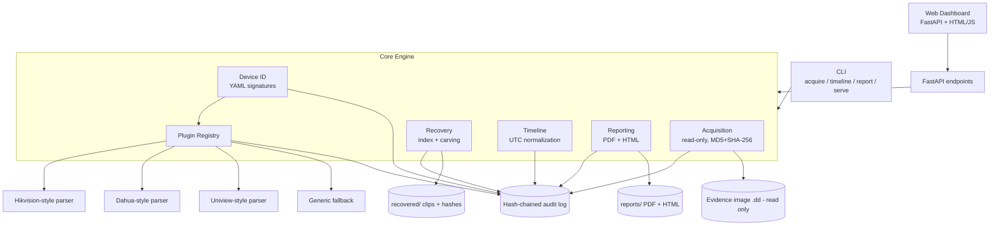
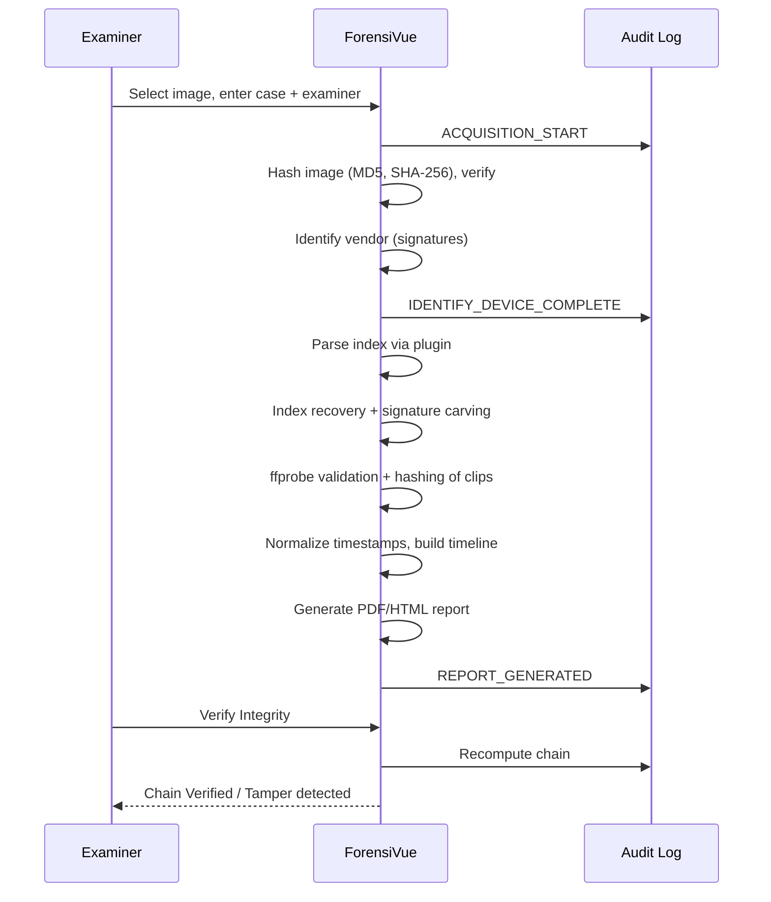

# ForensiVue System Architecture

## 1. Overview

ForensiVue is a Python engine with a CLI and a local web dashboard. Vendor knowledge lives in plugins; everything else (hashing, custody, timeline, recovery, reporting) is vendor-independent.

## 2. Component diagram

## 3. Data flow

## 4. Plugin interface

`BaseVendorParser` defines: `identify()`, `parse_filesystem()`, `list_recordings()`, `extract_video()`, `extract_metadata()`. Plugins in `forensivue/fs_parsers/` are auto-discovered by the registry. See `PLUGIN_TEMPLATE.md`.

Data models: `Recording`, `Channel`, `EvidenceItem`.

## 5. Chain of custody

Each audit entry stores timestamp, action, details and `previous_hash`. The entry hash covers the previous hash, so editing or deleting any entry breaks every later link. `verify_chain()` recomputes the chain and reports the first broken entry.

## 6. Design rules

1. Read-only evidence access.
2. Every action logged.
3. Hashes at acquisition and for every extracted item.
4. UTC timestamps with raw values retained.
5. Never fabricate results.
6. Offline operation (no external CDNs or network calls).

## 7. Technology

Python 3.11+, FastAPI/Uvicorn, SQLite-free JSONL audit log, FFmpeg/ffprobe, ReportLab, pytest.

## 8. Not implemented

AI analytics (motion, object, face detection) and real-vendor file-system parsers. The plugin and recovery layers are designed so these can be added.
